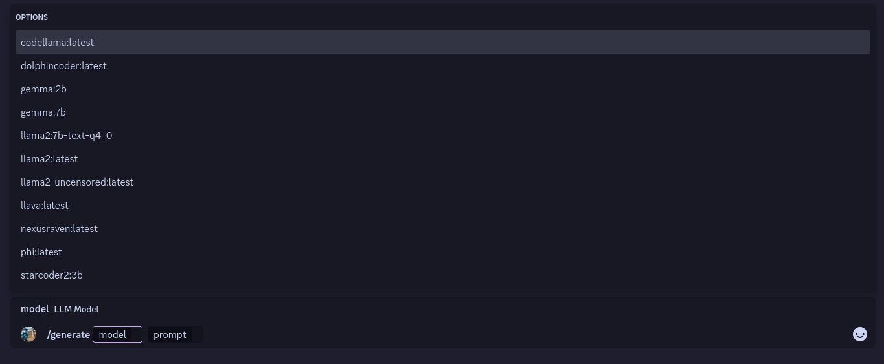
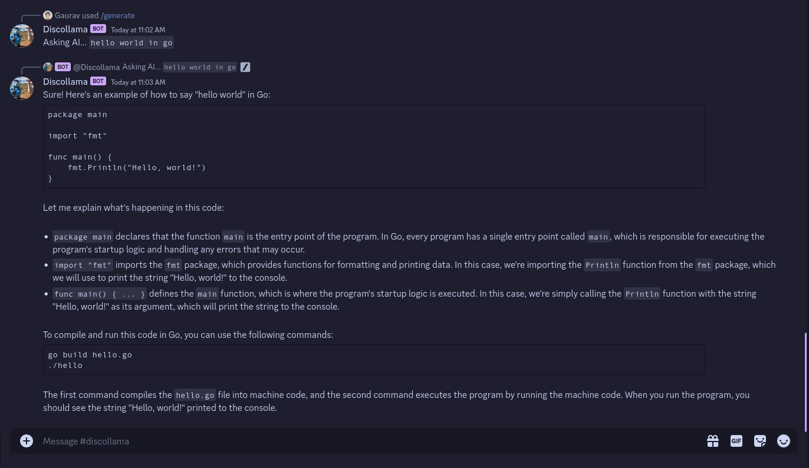

# 🕺 Discollama 🦙

Discollama is a Discord bot project written in Go. It uses the [DiscordGo](https://github.com/bwmarrin/discordgo) library to interact with the Discord API and provides users with the ability to generate text using models locally hosted using [Ollama](https://ollama.com/).

## 📚 Table of Contents

- [🕺 Discollama 🦙](#-discollama-)
  - [📚 Table of Contents](#-table-of-contents)
  - [🏗️ Structure](#️-structure)
  - [📦 Dependencies](#-dependencies)
  - [🔑 Prerequisites](#-prerequisites)
  - [⚙️ Setup](#️-setup)
  - [🎮 Usage](#-usage)
  - [🗺️ Roadmap](#️-roadmap)
  - [🤝 Contributing](#-contributing)
  - [📄 License](#-license)

## 🏗️ Structure

The project has the following structure:

```
go.mod
go.sum
main.go
utils/
	helpers/
		helpers.go
	ollama/
		ollama.go
```

## 📦 Dependencies

The project uses the following dependencies:

- `github.com/bwmarrin/discordgo` for interacting with the Discord API.

## 🔑 Prerequisites

- [Go](https://go.dev/) installed on your system.
- [Ollama](https://ollama.com/) installed on your system or a gollama API server accessible from your machine. (Default: `http://localhost:11434`) Read more about customizing the base URL [here](#options).
- Atleast one model installed on your Ollama server. You can install models using the `ollama pull <model-name>` command. To find a list of all available models, check the [Ollama Library](https://ollama.com/library/). You can also use the `ollama list` command to list all locally installed models.
- A Discord bot token. You can create a new bot on the [Discord Developer Portal](https://discord.com/developers/applications).

## ⚙️ Setup

To set up the bot, you need to provide the bot token and guild ID as command-line arguments. You can also specify whether to remove all commands after shutting down the bot. Optionally, you can provide the URL of the Ollama API.

```bash
Usage of discollama:
  -guild string
        Test guild ID. If not passed - bot registers commands globally
  -ollama-url string
        Ollama API URL (default "http://localhost:11434")
  -rmcmd
        Remove all commands after shutdowning or not (default true)
  -token string
        Bot access toke
```

Example:

```bash
go run main.go -token YOUR_BOT_TOKEN -guild YOUR_GUILD_ID -ollama-url YOUR_OLLAMA_URL -rmcmd true
```

## 🎮 Usage

Currently, the bot supports a single slash command `/generate` which lets users pick a model and ask the bot to generate text based on a provided prompt. The bot will then query the Ollama API to generate text and respond back to the user.

Using the slash command (`/generate`):


Example Response



## 🗺️ Roadmap
Here are the upcoming features we plan to implement:

- [ ] Add more commands for users to interact with.
- [ ] Improve error handling and logging.
- [ ] Implement a database for persistent data storage. (To keep chat context).
- [ ] Implement ability to attach images for multi-modal LLMs.
- [ ] Implement ability to attach pdfs for RAG.

## 🤝 Contributing

Pull requests are welcome. For major changes, please open an issue first to discuss what you would like to change.

## 📄 License

This project is licensed under the [MIT License](https://choosealicense.com/licenses/mit/).
